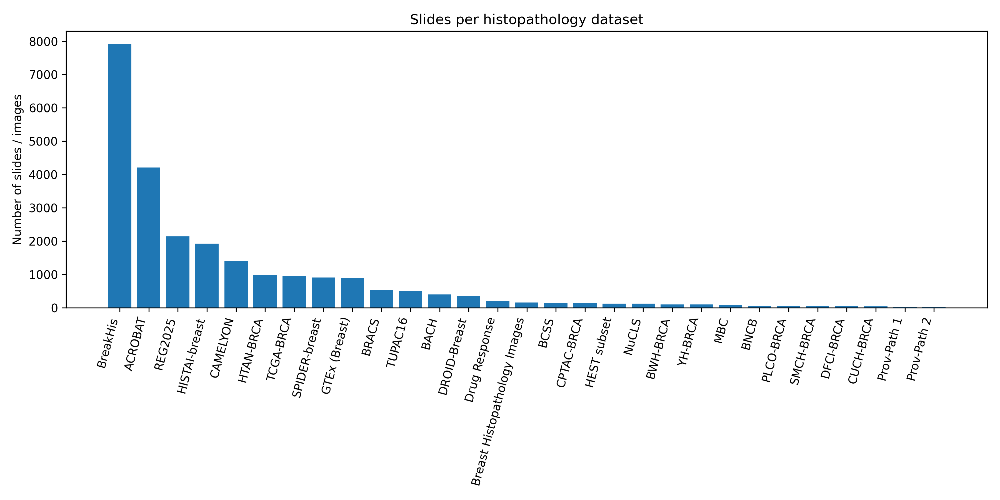

# Breast Cancer Imaging Datasets 

This is the summary of breast cancer imaging datasets I use in my PhD  
(WSIs, patch–level datasets, segmentation / nuclei labels, clinical & drug–response data, etc.).

> ⚠️ This is **not** a redistributable dataset repo.  
> Links point to the original sources. Local paths are specific to my HPC (QRISdata / scratch).

---

## Overview figures

---

## Table of Contents

- [Quick Overview Table](#quick-overview-table)
- [Dataset Notes](#dataset-notes)
  - [BreakHis](#breakhis)
  - [ACROBAT](#acrobat)
  - [REG2025](#reg2025)
  - [HISTAI-breast](#histai-breast)
  - [CAMELYON](#camelyon)
  - [HTAN-BRCA](#htan-brca)
  - [TCGA-BRCA](#tcga-brca)
  - [SPIDER-breast](#spider-breast)
  - [GTEx (Breast)](#gtex-breast)
  - [BRACS](#bracs)
  - [TUPAC16](#tupac16)
  - [BACH](#bach)
  - [DROID-Breast](#droid-breast)
  - [Drug Response dataset](#drug-response-dataset)
  - [Breast Histopathology Images (Kaggle)](#breast-histopathology-images-kaggle)
  - [BCSS](#bcss)
  - [CPTAC-BRCA](#cptac-brca)
  - [HEST subset](#hest-subset)
  - [NuCLS](#nucls)
  - [YH-BRCA](#yh-brca)
  - [MBC](#mbc)
  - [BNCB](#bncb)
  - [BWH-BRCA](#bwh-brca)
  - [PLCO-BRCA](#plco-brca)
  - [SMCH-BRCA](#smch-brca)
  - [DFCI-BRCA](#dfci-brca)
  - [CUCH-BRCA](#cuch-brca)
  - [Prov-Path 1](#prov-path-1)
  - [Prov-Path 2](#prov-path-2)
  - [DCISM](#DCISM)
  - [SLN-Breast](#SLN-Breast)
  - [Post-NAT-BRCA](#SLN-Breast)
  - [TheuRes_Stephen2021](#TheuRes_Stephen2021)
  - [HER2_Tumor_ROIs](#HER2_Tumor_ROIs)
  - [HistologyHSI-BC-Recurrence](#HistologyHSI-BC-Recurrence)
  - [AURORA-Metastatic-Breast-Multiomics](#AURORA-Metastatic-Breast-Multiomics)

---

## Quick Overview Table

| Dataset | Model / Project | Source type | Usage in study | Slides / Images | Task (rough) | Access |
|--------|-----------------|-------------|----------------|-----------------|--------------|--------|
| BreakHis | BEPH | Public | – | 9,109 images | Cancer / patch classification | [Link](http://www.inf.ufpr.br/vri/databases/BreaKHis_v1.tar.gz) |
| ACROBAT | CHIEF | Public | Pretrain | 4,212 WSIs | Biomarker / ER, PR, HER2, Ki67 | [Portal](https://researchdata.se/sv/catalogue/dataset/2022-190-1/1) |
| REG2025 | – | Public | – | 2,143 | WSI + clinical | [GC challenge](https://reg2025.grand-challenge.org/reg2025-traindataset/) |
| HISTAI-breast | – | Public | – | 1,925 | Patch/WSI classification | [HF dataset](https://huggingface.co/datasets/histai/HISTAI-breast) |
| CAMELYON | BEPH | Public | – | 1,399 WSIs | Cancer / metastasis | [GigaDB](http://gigadb.org/dataset/100439) |
| HTAN-BRCA | – | Public | – | 982 H&E | Multi-omics atlas | [HTAN portal](https://humantumoratlas.org/explore) |
| TCGA-BRCA | CHIEF | Public | Held-out survival | 963 WSIs | Subtype / prognosis | [GDC](https://portal.gdc.cancer.gov/projects/TCGA-BRCA) |
| SPIDER-breast | – | Public | – | 912 | Patch + context | [HF dataset](https://huggingface.co/datasets/histai/SPIDER-breast) |
| GTEx (Breast) | THREAD | Public | Pretrain | 894 | Normal breast | [GTEx histology](https://www.gtexportal.org/home/histologyPage) |
| BRACS | UNI | Public | – | 547 WSIs | Subtype | [BRACS site](https://www.bracs.icar.cnr.it/download/) |
| TUPAC16 | – | Public | – | 500 | Proliferation / biomarker | [Challenge](https://tupac.grand-challenge.org/) |
| BACH | BEPH | Public | – | 400 | 4-class patch classification | [ICiar 2018](https://iciar2018-challenge.grand-challenge.org/Dataset/) |
| DROID-Breast | CHIEF | Public | Val (cell det.) | 361 WSIs | Cancer cell detection | Email: claes.lundstrom@liu.se |
| Drug Response | – | Public | Train & Val | 204 | Drug response | [Zenodo](https://zenodo.org/records/6337925#.Y30d1y-l1Ls) |
| Breast Histopathology Images | – | Public | – | 162 | Patch classification | [Kaggle](https://www.kaggle.com/datasets/paultimothymooney/breast-histopathology-images) |
| BCSS | – | Public | – | 151 | Tissue segmentation | [GitHub](https://github.com/PathologyDataScience/BCSS) |
| CPTAC-BRCA | CHIEF | Public | Origin ID | 134 cases | Subtype / origin | [TCIA collection](https://www.cancerimagingarchive.net/collection/cptac-brca/) |
| HEST subset | – | – | Val | 125 | Biomarker | – |
| NuCLS | – | Public | – | 124 WSIs | Nuclei labels | [NuCLS site](https://sites.google.com/view/nucls/multi-rater?authuser=0) |
| YH-BRCA | CHIEF | Institutional | Pretrain | 98 | Mixed | Email: Kun-Hsing_Yu@hms.harvard.edu |
| MBC | THREAD | Public | – | 99 WSIs (77 pts) | Metastatic BC | [Synapse](https://www.synapse.org/Synapse:syn59490671/wiki/628046) |
| BNCB | CHIEF | Public | Pretrain | 58 | Biopsy WSIs | [Drive folder](https://drive.google.com/drive/folders/1HcAgplKwbSZ7ZZl2m6PZdvVF70QJmVuR) |
| BWH-BRCA | CHIEF | Institutional | Cell det. | 104 WSIs | Cancer cell detection | Email: Kun-Hsing_Yu@hms.harvard.edu |
| PLCO-BRCA | CHIEF | Control | Cell det. | 647 WSIs | Control cohort | [CDAS](https://cdas.cancer.gov/datasets/plco/19/) |
| SMCH-BRCA | CHIEF | Institutional | Cell det. | 52 | Cancer cell detection | Email: Kun-Hsing_Yu@hms.harvard.edu |
| DFCI-BRCA | CHIEF | Institutional | Survival | 48 WSIs | Survival prediction | Email: Kun-Hsing_Yu@hms.harvard.edu |
| CUCH-BRCA | CHIEF | Institutional | Cell det. | 42 | Cancer cell detection | Email: Kun-Hsing_Yu@hms.harvard.edu |
| Prov-Path 1 | Prov-GigaPath | Public | – | 15 | GigaPath cohort | [Zenodo](https://zenodo.org/records/10909922) |
| Prov-Path 2 | Prov-GigaPath | Public | – | 15 | GigaPath cohort | [Zenodo](https://zenodo.org/records/10909616) |
| DCISM | - | Public | Subtype | 12 | Subtype | [TCIA](https://www.cancerimagingarchive.net/collection/he-vs-mpm/) | 
| SLN-Breast | - | Public | Cancer Detection | 130 | Classification | [TCIA](https://www.cancerimagingarchive.net/collection/sln-breast/)|
| Post-NAT-BRCA| - | Public | Treatment Response | 64 | Cell annotation | [TCIA](https://www.cancerimagingarchive.net/collection/post-nat-brca/)|
| TheuRes_Stephen2021 | [NAT-ML](https://github.com/micrisor/NAT-ML) | Public | Treatment Response | 168 | Multiomic + Treat | [Zenodo](https://zenodo.org/records/6337925#.Y30d1y-l1Ls) |
| HER2_Tumor_ROIs | [CNN](https://www.modernpathology.org/article/S0893-3952(22)00349-0/fulltext) | Public | Treatment Response | 273 | Histo + Cli + Molecular test | [TCIA](https://www.cancerimagingarchive.net/collection/her2-tumor-rois/) | 
| HistologyHSI-BC-Recurrence | - | Pulic | Recurrence Prediction | 47 | WSI + Hyperspectral + Cli | [TCIA](https://www.cancerimagingarchive.net/collection/histologyhsi-bc-recurrence/)
| AURORA-Metastatic-Breast-Multiomics | - | Public | Metastatic vs Primary | 55 | WSI + IHC + Cli + Omics | [TCIA](https://www.cancerimagingarchive.net/collection/aurora-metastatic-breast-multiomics/)

---

## Dataset Notes

*(This is the “note” part – feel free to add bullet points, TODOs, caveats, QC info, etc.)*

### BreakHis

- **Model / project:** BEPH  
- **Type:** Public, microscopic images (40X, 100X, 200X, 400X)  
- **Size:** 9,109 images from 82 patients  
- **Source / access:**  
  - Download: <http://www.inf.ufpr.br/vri/databases/BreaKHis_v1.tar.gz>  
  - Info page: <https://web.inf.ufpr.br/vri/databases/breast-cancer-histopathological-database-breakhis/>
- **Local path:** `/scratch/project_mnt/S0010/Hao/BreakHis`
- **Typical tasks:** Benign vs malignant, multi-class tumour subtype (patch-level)  
- **My notes:**  
  - TODO: write how I split magnifications / train-val-test.  
  - TODO: note any preprocessing steps (stain norm, patch filtering, etc.).

---

### ACROBAT

- **Model / project:** CHIEF  
- **Type:** Public WSIs (H&E + IHC ER/PR/HER2/Ki67)  
- **Size:** 4,212 WSIs from 1,153 primary BC patients  
- **Usage in my study:** Pretraining for biomarker / ER-PR-HER2 Ki67  
- **Access:** <https://researchdata.se/sv/catalogue/dataset/2022-190-1/1>  
- **Local path:** `/QRISdata/Q2051/Hao/ACROBAT`
- **Task:** Biomarker, stain-aware pretraining  
- **My notes:**  
  - TODO: record which stain subsets I actually downloaded.  
  - TODO: mapping from IHC labels to training targets (ER status, etc.).

---

### REG2025

- **Model / project:** –  
- **Type:** Public challenge dataset, WSI + clinical pairs  
- **Size:** ~2,143 slides  
- **Access:** <https://reg2025.grand-challenge.org/reg2025-traindataset/>  
- **Task:** Risk prediction / clinical outcome (depending on challenge track)  
- **My notes:**  
  - TODO: document which split / track I use.  
  - TODO: clinical variables I care about (e.g. survival, grade, receptor status).

---

### HISTAI-breast

- **Type:** Public  
- **Size:** 1,925 entries (HISTAI-breast dataset)  
- **Access:** <https://huggingface.co/datasets/histai/HISTAI-breast>  
- **My notes:**  
  - TODO: clarify if used for contrastive / self-supervision or supervised.  

---

### CAMELYON

- **Model / project:** BEPH  
- **Type:** Public, lymph node WSIs  
- **Size:** 1,399 WSIs of sentinel lymph nodes  
- **Access:**  
  - Download: <http://gigadb.org/dataset/100439>  
  - DOI: `10.5524/100439`
- **Task:** Metastasis detection (cancer vs normal)  
- **My notes:**  
  - TODO: whether I use pixel-level annotations or slide-level only.  

---

### HTAN-BRCA

- **Type:** Public, multi-omics tumor atlas  
- **Size:** 982 H&E slides (Breast + H&E filter)  
- **Access:**  
  - HTAN explorer (filtered breast + H&E):  
    <https://humantumoratlas.org/explore?...>  <!-- full URL in original table -->
- **Local path:** `/QRISdata/Q1851/Hao/htan`
- **My notes:**  
  - TODO: how I link H&E to spatial / single-cell data (if any).  

---

### TCGA-BRCA

- **Model / project:** CHIEF  
- **Type:** Public, TCGA breast  
- **Size:** 963 WSIs (IDC ≈ 767, ILC ≈ 196)  
- **Usage in my study:** Held-out validation for survival prediction, subtype tasks  
- **Access:** <https://portal.gdc.cancer.gov/projects/TCGA-BRCA>  
- **Task:** Subtype, survival  
- **My notes:**  
  - TODO: list exact TCGA barcodes used.  
  - TODO: mapping between slide IDs and clinical table.

---

### SPIDER-breast

- **Type:** Public, supervised patch + context dataset  
- **Size:** 912 composite samples  
- **Description:**  
  - Central 224×224 patch with class label  
  - 24 surrounding context patches (total region 1120×1120 at 20X)  
- **Access:** <https://huggingface.co/datasets/histai/SPIDER-breast>  
- **Local path:** `/QRISdata/Q1851/val_data`
- **My notes:**  
  - TODO: how I use this to probe context modeling or attention.

---

### GTEx (Breast)

- **Model / project:** THREAD  
- **Type:** Public normal breast histology  
- **Size:** 894 images  
- **Access:** <https://www.gtexportal.org/home/histologyPage>  
- **Task:** Normal-tissue pretraining / domain adaptation  
- **My notes:**  
  - TODO: note which slides used as “normal controls”.

---

### BRACS

- **Model / project:** UNI  
- **Type:** Public WSIs  
- **Size:** 547 labeled WSIs  
- **Access:** <https://www.bracs.icar.cnr.it/download/>  
- **Extra:** `wget –no-parent -r ftp://histoimage.na.icar.cnr.it/`  
- **Task:** Subtype classification  
- **My notes:**  
  - TODO: internal split vs official split.

---

### TUPAC16

- **Type:** Public challenge dataset  
- **Size:** 500 slides  
- **Access:** <https://tupac.grand-challenge.org/>  
- **Task:** Proliferation / biomarker-related tasks  
- **My notes:**  
  - TODO: whether I use mitosis labels or only slide-level scores.

---

### BACH

- **Model / project:** BEPH  
- **Type:** Public patch dataset  
- **Size:** 400 images  
- **Classes:** normal, benign, in situ, invasive carcinoma  
- **Access:** <https://iciar2018-challenge.grand-challenge.org/Dataset/>  
- **My notes:**  
  - TODO: mapping BACH labels to BEPH labels (if any).

---

### DROID-Breast

- **Model / project:** CHIEF  
- **Type:** Public WSIs  
- **Size:** 361 H&E slides  
- **Usage in my study:** Cancer cell detection validation  
- **Access:** Email `claes.lundstrom@liu.se`  
- **My notes:**  
  - TODO: how to get annotations & license details.

---

### Drug Response dataset

- **Type:** Public  
- **Size:** 204 samples  
- **Usage:** Train & validate for drug-response modeling  
- **Access:**  
  - Zenodo: <https://zenodo.org/records/6337925#.Y30d1y-l1Ls>  
  - Paper: <https://www.nature.com/articles/s41586-021-04278-5>  
- **Local path:** `/QRISdata/Q1851/val_data`
- **My notes:**  
  - TODO: which cell lines or patient-derived samples I actually use.

---

### Breast Histopathology Images (Kaggle)

- **Type:** Public patch dataset  
- **Size:** 162 images (plus patch structure in Kaggle description)  
- **Access:** <https://www.kaggle.com/datasets/paultimothymooney/breast-histopathology-images>  
- **My notes:**  
  - TODO: whether I use full dataset or subset.

---

### BCSS

- **Type:** Public segmentation dataset  
- **Size:** 151 slides, >20k tissue-region segmentations  
- **Access:** <https://github.com/PathologyDataScience/BCSS>  
- **Task:** Tissue-region segmentation (stroma, tumour, etc.)  
- **My notes:**  
  - TODO: which classes are relevant for my TME analysis.

---

### CPTAC-BRCA

- **Model / project:** Jaehnig, E.J., Fernandez-Martinez, A., Vashist, T.D., Holt, M.V., Williams, L., Lei, J.T., Moon, C.I., Kim, B.-J., Dou, Y., Zhao, H., Korchina, V., Gibbs, R.A., Muzny, D.M., Doddapaneni, H., Perou, C.M., Carey, L.A., Robles, A.I., Hyslop, T., Wen, Y., McCart, L., Krek, A., Petralia, F., Miles, G., Kavuri, S.M., Gillette, M.A., Mani, D.R., Carr, S.A., Zhang, B., Ellis, M.J., Satpathy, S. and Anurag, M. (2025) “Proteogenomic analysis of the CALGB 40601 (Alliance) HER2+ breast cancer neoadjuvant trial reveals resistance biomarkers,” Cell Reports Medicine, 6(6), p. 102154. Available at: PMID: 40480221 DOI: 10.1016/j.xcrm.2025.102154
- **Type:** Public WSIs with multi-omics (proteomics etc.)  
- **Size:** 134 primary tumor slides (~328 BRCA cases)  
- **Access:** <https://www.cancerimagingarchive.net/collection/cptac-brca/>  
- **Task:** Subtype, tumour-origin identification  
- **My notes:**  
  - TODO: link to proteomics table, if needed for multimodal aim.

---

### HEST subset

- **Model / project:** HEST  
- **Type:** Internal subset (details TBD)  
- **Size:** 125 slides  
- **Usage in my study:** Biomarker validation  
- **My notes:**  
  - TODO: specify which collection this subset came from.

---

### NuCLS

- **Type:** Public, nuclei-level annotations  
- **Size:** >220k labeled nuclei from TCGA breast images  
- **Access:** <https://sites.google.com/view/nucls/multi-rater?authuser=0>  
- **Task:** Nuclei detection / classification  
- **My notes:**  
  - TODO: whether I use this for training cell detectors (CellViT / CellPose-SAM etc.).

---

### YH-BRCA

- **Model / project:** CHIEF  
- **Type:** Institutional  
- **Size:** 98 cases (details not clearly stated)  
- **Access:** Email `Kun-Hsing_Yu@hms.harvard.edu`  
- **Usage in my study:** Pretraining / internal validation  
- **My notes:**  
  - TODO: summary once I get the data.

---

### MBC

- **Model / project:** THREAD  
- **Type:** Public, metastatic breast cancer  
- **Size:** 77 patients, 99 WSIs  
- **Access:** <https://www.synapse.org/Synapse:syn59490671/wiki/628046>  
- **My notes:**  
  - TODO: endpoints I care about (site of metastasis, survival, etc.).

---

### BNCB

- **Model / project:** CHIEF  
- **Type:** Public, biopsy WSIs (core needle)  
- **Size:** 58 patients  
- **Description:** Tumour annotations partially provided; clinical metadata included  
- **Access:** <https://drive.google.com/drive/folders/1HcAgplKwbSZ7ZZl2m6PZdvVF70QJmVuR>  
- **Task:** Cancer detection / core biopsy analysis  
- **My notes:**  
  - TODO: note annotation format (XML / JSON / etc.).

---

### BWH-BRCA

- **Model / project:** CHIEF  
- **Type:** Institutional  
- **Size:** 104 WSIs  
- **Usage:** Cancer cell detection  
- **Access:** Email `Kun-Hsing_Yu@hms.harvard.edu`  
- **My notes:**  
  - TODO: if/when I manage to get access.

---

### PLCO-BRCA

- **Model / project:** CHIEF  
- **Type:** Control cohort  
- **Size:** 52 patients, 647 WSIs  
- **Usage:** Cancer cell detection controls  
- **Access:** <https://cdas.cancer.gov/datasets/plco/19/> (via CDAS)  
- **My notes:**  
  - TODO: exactly how controls are used in CHIEF-style training.

---

### SMCH-BRCA

- **Model / project:** CHIEF  
- **Type:** Institutional  
- **Size:** 52 cases (details not stated)  
- **Usage:** Cancer cell detection  
- **Access:** Email `Kun-Hsing_Yu@hms.harvard.edu`  
- **My notes:**  
  - TODO: fill in details once available.

---

### DFCI-BRCA

- **Model / project:** CHIEF  
- **Type:** Institutional  
- **Size:** 48 WSIs  
- **Usage:** Survival prediction  
- **Access:** Email `Kun-Hsing_Yu@hms.harvard.edu`  
- **My notes:**  
  - TODO: confirm clinical endpoints (OS/DFS etc.).

---

### CUCH-BRCA

- **Model / project:** CHIEF  
- **Type:** Institutional  
- **Size:** 42 cases  
- **Usage:** Cancer cell detection  
- **Access:** Email `Kun-Hsing_Yu@hms.harvard.edu`  
- **My notes:**  
  - TODO: dataset details.

---

### Prov-Path 1

- **Model / project:** Prov-GigaPath  
- **Type:** Public  
- **Size:** 15 slides  
- **Access:** <https://zenodo.org/records/10909922>  
- **Usage:** GigaPath pretraining / evaluation  
- **My notes:**  
  - TODO: which splits / labels.

---

### Prov-Path 2

- **Model / project:** Prov-GigaPath  
- **Type:** Public  
- **Size:** 15 slides  
- **Access:** <https://zenodo.org/records/10909616>  
- **Usage:** GigaPath pretraining / evaluation  
- **My notes:**  
  - TODO: link + compare with Prov-Path 1 (different cohort?).
 
---

### DCISM

- **Model / project:** Han, X., Liu, Y., Zhang, S., Li, L., Zheng, L., Qiu, L., Chen, J., Zhan, Z., Wang, S., Ma, J., Kang, D., & Chen, J. (2024). Improving the diagnosis of ductal carcinoma in situ with microinvasion without immunohistochemistry: An innovative method with H&E‐stained and multiphoton microscopy images. In International Journal of Cancer (Vol. 154, Issue 10, pp. 1802–1813). Wiley. https://doi.org/10.1002/ijc.34855
- **Type:** Public  
- **Size:** 12 patients  
- **Access:** <https://www.cancerimagingarchive.net/collection/he-vs-mpm/>
- **Usage:** subtype detection
- **My notes:**  Ductal carcinoma in situ with microinvasion (DCISM) is a challenging subtype of breast cancer with controversial invasiveness and prognosis. Accurate diagnosis of DCISM from ductal carcinoma in situ (DCIS) is crucial for optimal treatment and improved clinical outcomes. This dataset provides histopathology images and paired CK5/6 immunohistochemical staining images from patients with DCISM, as well as multiphoton microscopy images of suspicious regions. It offers multi-modal imaging data from various perspectives for analysis and diagnosis of microinvasive breast cancer by other researchers in the field. The dataset contains data from 12 breast cancer patients, including 10 cases of ductal carcinoma in situ with microinvasion (DCISM), 1 case of ductal carcinoma in situ (DCIS), and 1 case of invasive breast cancer.
  
---

### SLN-Breast

- **Model / project:** Campanella, G., Hanna, M. G., Geneslaw, L., Miraflor, A., Werneck Krauss Silva, V., Busam, K. J., Brogi, E., Reuter, V. E., Klimstra, D. S., & Fuchs, T. J. (2019). Clinical-grade computational pathology using weakly supervised deep learning on whole slide images. Nature Medicine (Vol. 25, Issue 8, pp. 1301–1309). Springer Science and Business Media LLC. https://doi.org/10.1038/s41591-019-0508-1
- **Type:** Public  
- **Size:** 130 patients  
- **Access:** <https://www.cancerimagingarchive.net/collection/sln-breast/>
- **Usage:** Cancer detection /Classification task
- **My notes:**  The dataset consists of 130 de-identified whole slide images of H&E stained axillary lymph node specimens from 78 patients. Metastatic breast carcinoma is present in 36 of the WSI from 27 patients. No patient inclusion/exclusion criteria were followed. No slide inclusion/exclusion criteria were followed. The slides were scanned at Memorial Sloan Kettering Cancer Center (MSKCC) with Leica Aperio AT2 scanners at 20x equivalent magnification (0.5 microns per pixel). Together with the slides, the class label of each slide, either positive or negative for breast carcinoma, is given. The slide class label was obtained from the pathology report of the respective case.

---

### Post-NAT-BRCA

- **Type:** Public segmentation dataset, Treatment Response dataset  
- **Size:** 64 patient 
- **Access:** <https://www.cancerimagingarchive.net/collection/post-nat-brca/>
- **Task:** Treatment response, cell level annotation
- **My notes:**  The Post-NAT-BRCA dataset is a collection of representative sections from breast resections in patients with residual invasive BC following NAT. Histologic sections were prepared and digitized to produce high resolution, microscopic images of treated BC tumors. Also included, are clinical features and expert pathology annotations of tumor cellularity and cell types. The Residual Cancer Burden Index (RCBi), is a clinically validated tool for assessment of response to NAT associated with prognosis. Tumor cellularity is one of the parameters used for calculating the RCBi. In this dataset, tumor cellularity refers to a measure of residual disease after NAT, in the form of proportion of malignant tumor inside the tumor bed region; also annotated. (See MD Anderson RCB Calculator for a detailed description of tumor cellularity.) Malignant, healthy, lymphocyte and other labels were also provided for individual cells to aid development of cell segmentation algorithms.
 
---
### TheuRes_Stephen2021

- **Model / project:** NAT-ML
- **Type:** Public, whole exome sequencing (mutation), shallow WGS (copy no), RNA seq (GE), digital pathology (tissue img)
- **Size:** 168 
- **My notes:**  
  - TODO: can be used for aim 3
  - genomic data here <https://github.com/cclab-brca/neoadjuvant-therapy-response-predictor/tree/master#>
  - paper <https://www.nature.com/articles/s41586-021-04278-5>

---
### HER2_Tumor_ROIs

- **Model / project:** NAT-ML
- **Type:** Histopathology, Whole Slide Image, Follow-Up, Molecular Test, Measurement
- **Size:** 273
- **My notes:**  
  - TODO: can be used for aim 3
  - HER2+ Breast Cancer, Metastatic disease 

---

### HistologyHSI-BC-Recurrence

- **Model / project:** HistologyHSI-BC-Recurrence
- **Type:** Whole Slide Image, Hyperspectral, Follow-Up, Pathology Detail, Other, Demographic, 12 year follow up recurrence
- Multimodal data has emerged as a promising tool to integrate diverse information, offering a more comprehensive perspective. This study introduces the HistologyHSI-BC-Recurrence Database, the first publicly accessible multimodal dataset designed to advance distant recurrence prediction in breast cancer (BC). The dataset comprises 47 histopathological whole-slide images (WSIs), 677 hyperspectral (HS) images, and demographic and clinical data from 47 BC patients, of whom 22 (47%) experienced distant recurrence over a 12-year follow-up. Histopathological slides were digitized using a WSI scanner and annotated by expert pathologists, while HS images were acquired with a bright-field microscope and a HS camera. This dataset provides a promising resource for BC recurrence prediction and personalized treatment strategies by integrating histopathological WSIs, HS images, and demographic and clinical data.
- **Size:** 47
- **My notes:**  
  - TODO: can be used for aim 3
  - Ductal Carcinoma, Breast Invasive Carcinoma

---

### AURORA-Metastatic-Breast-Multiomics

- **Model / project:** Multiomics in primary and metastatic breast tumors from the AURORA US network finds microenvironment and epigenetic drivers of metastasis
- **Type:** Histopathology, Pathology Detail, Other, Immunofluorescence, Whole Slide Image
- In the retrospective phase, 55 patients with 31 primary tissues and 102 metastases were profiled using whole genome DNA sequencing, whole exome DNA sequencing, DNA methylation arrays, and RNA sequencing. The related molecular data are hosted in dbGaP and GEO. H&E slides are available for 184 specimens (17 samples have 2 images, 12 have 3 images).  H&E were performed on 53 primary breast cancer tissues, 99 metastatic samples, and 32 adjacent normal tissues. HLA-A immunofluorescence was performed on 37 samples.  
- **Size:** 55
- **My notes:**  
  - TODO: can be used for aim 3
  - Pri vs Meta
  - Paper <https://doi.org/10.1038/s43018-022-00491-x>

---
### CMB-BRCA 

- **Model / project:** Cancer Moonshot Biobank - Invasive Breast Carcinoma Cancer Collection
- **Type:**	Histopathology, Whole Slide Image, MR, CT, MG, PT, US
- IDuring the course of this study, biospecimens (blood and tissue removed during medical procedures) and associated data will be collected longitudinally from at least 1000 patients across at least 10 cancer types, who are receiving standard of care cancer treatment at multiple NCI Community Oncology Research Program (NCORP) sites. This collection contains de-identified radiology and histopathology imaging procured from subjects in NCI’s Cancer Moonshot Biobank - Invasive Breast Carcinoma Cancer (CMB-BRCA) cohort. Associated genomic, phenotypic and clinical data will be hosted by The Database of Genotypes and Phenotypes (dbGaP) and other NCI databases.  A summary of Cancer Moonshot Biobank imaging efforts can be found on the Cancer Moonshot Biobank Imaging page.
- **Size:** 97
- **My notes:**  
  - TODO: can be used for aim 3
  - Breast Invasive Carcinoma
  - need to request genomic data
Cancer Moonshot Biobank. (2024). Cancer Moonshot Biobank – Invasive Breast Carcinoma Cancer Collection (CMB-BRCA) (Version 4) [dataset]. The Cancer Imaging Archive. https://doi.org/10.7937/dx22-8j71

---

## How I Use This Repo

- As a **memory** of where things live on HPC.
- To track which datasets I actually used in:
  - Aim 1 (spatial characterization),
  - Aim 2 (gene-expression prediction from H&E),
  - Aim 3 (multimodal integration).
 
--- 

## Contributing & Contact
- **Contributions:**  
  Suggestions for new datasets, updates, or corrections are welcome. Please open an issue or submit a pull request.

- **Contact:**  
  For specific dataset access, follow the provided links or contact dataset maintainers directly.  For repository-related questions or inquiries, feel free to email me at [hao.nguyen@uq.edu.au](mailto:hao.nguyen@uq.edu.au).
